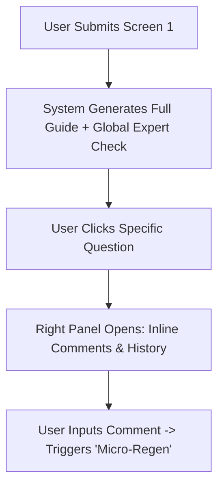

# Product Requirement Document (PRD) v2.01

## 1. Project Overview & Core Value Prop
An interactive, single-workspace engine designed to translate raw project requirements into objective, industry-standard interview guides. The application removes human bias, enforces methodological structure, and allows cross-functional collaboration via contextual, localized feedback loops.

---

## 2. User Architecture & Screen Specifications

### 2.1 Screen 1: Intelligent Intake Form
The goal of this screen is to capture comprehensive alignment context before hitting the AI generation engine.

#### Metadata Components
* **Project Name**: Text input.
* **Project Overview & Goals**: Rich text area.
* **Target Audience Description**: Text area with optional trait tags.
* **Reference Materials**: URL upload chips or text links to internal wikis/PRDs.

#### Structural Configuration Component (Main Interview Structure)
Rather than a simple empty text box, this acts as an interactive list that provides standard industrial defaults:

$$\text{Warm-up / Rapport Building} \rightarrow \text{Core Behavioral Inquiries} \rightarrow \text{Deep-Dive / Follow-ups} \rightarrow \text{Wrap-up}$$

Users can add, delete, rename, or reorder these blocks to match their specific study design.

---

### 2.2 Screen 2: The Interactive Research Canvas (Unified View)
Once the user clicks **"Generate Guide"**, they are taken to a split-screen canvas that handles reading, commenting, and targeted regeneration in parallel.

#### Left Canvas: The Structural Output Engine
Displays the research questions cleanly grouped under the structural sections defined in Screen 1.
* **Component Interactions**:
  * Hovering over any question reveals a contextual action menu: `[Comment]`, `[Regenerate Single Item]`, `[Delete]`, and `[Drag-to-Reorder]`.
  * Clicking a question activates it, highlighting the boundary and opening its deep-dive tools in the right panel.

#### Right Canvas: The Multi-Mode Context Panel
This side panel dynamically changes state based on user interaction, consolidating the original Screens 3 & 4.

##### **State A: Global Expert Analytics (Default State)**
* **Methodological Check**: Analyzes the overall guide against industrial best practices.
* *Examples*: 
  * *"Found 2 potentially leading questions in Section 2."*
  * *"Suggested focus shift: Target audience notes familiarity with crypto, but warm-up questions assume absolute beginner status."*

##### **State B: Threaded Item Commentary & Fine-Tuning (On-Click State)**
* Displays a dedicated, threaded conversation space for the selected question.
* Includes a prominent **"Regenerate Selected Block"** button that feeds the user's text comments directly back into the LLM context to alter only that specific segment.
* **Version Compare**: Displays a toggle switch between Original and Revised text inline so changes are obvious.

---

## 3. Core Functional Requirements

### User Flow Sequence

* **FR-01: Micro-Contextual Regeneration**
  The application must possess the ability to run scoped prompt queries. If a user leaves a comment on a single question in the "Warm up" section, the system must update only that block without destroying modifications made to other sections.
* **FR-02: Structured Schema Preservation**
  No matter how many times an item is regenerated, the output must rigidly conform to the overarching structure:
  $$\text{Objective} \rightarrow \text{Core Question} \rightarrow \text{Probing/Follow-up Prompts}$$
* **FR-03: Expert Heuristics Engine**
  The system prompt must evaluate the output text against common UX research anti-patterns: leading questions, double-barreled questions (asking two things at once), and overly technical/internal jargon.

---

## 4. Technical Constraints & Scalability

* **State Management**:
  Because users can write comments, view history, and trigger multi-level regenerations, the application must maintain a clean, nested immutable state tree mapping:
  $$\text{Section} \rightarrow \text{QuestionID} \rightarrow \text{VersionHistory[]} \rightarrow \text{CommentThread[]}$$
* **Prompt Decoupling**:
  To keep this reusable across industries, the structural prompt logic must remain completely agnostic of the topic. The domain context (e.g., B2B SaaS vs Web3 DeFi) is injected cleanly as variables.
